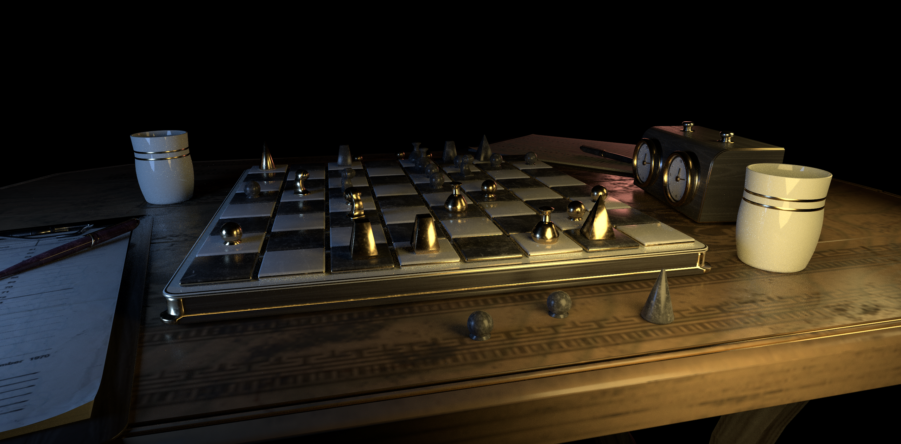

## Overview
I spent a few time in 2021 learning realtime rendering techniques and graphics API such as OpenGL and DirectX 12.
I then immediately turn to DirectX Raytracing (DXR) as a big fan of tracing rays.
So this is yet another (the second) global illumination renderer I have written so far.
Though it is quite similar to my first ray tracer **Colvillea**, it is based on the graphics API (DXR) as opposed to GPGPU one (like CUDA or OpenCL).

## Some Sneaky Stuff on the Road
I think I might have run into some issues during the journey and doing some renderings again is indeed a bit more difficult than before.
Well, I have learned ray tracing before and related algorithms will not change if I switch to another way of implementation -- no matter I write in plain C/old school C++/modern C++/CUDA/HLSL, the math and physics behind the rendering are essentially the same.
However, the coding process could suffer:



For example, it is useful to support two-sided shading for the ray tracer.
Since common 3d modeling packages such as Maya and Blender usually enable two-sided shading by default, artist may ignore the orientation of the surface during the modeling.
If we look at a surface from backside, we could still receive the lighting reflected from this object.
But checking the side orientation inside the implementation of BRDF classes is bothersome and inspired by Mitsuba, we have an elegant approach for this.
The idea is to add a new so-called *two-sided BRDF* to wrap the *one-sided BRDF* -- we keep the implementation as-is in *one-sided BRDF* (do the shading as long as the incoming ray and the outgoing ray are in the same hemisphere as the surface's normal) and flip the ray direction in *two-sided BRDF* when necessary.
You could have a look at the [Figure 1](#figure-sneaky) if you are not sure about what I mean.

Well the coding in C++/C/C#... is pretty straightforward due to the language support for class, member functions, function pointers (and even templates for C++ gurus).
However, in HLSL, none of these great features exists and I believe it's even worse in GLSL.
The good news is that to avoid replicating the *two-sided BRDF* code for each BRDF type, we could use macro...
But the bad news is HLSL's preprocessor are not the same as C++/C's preprocessor, which supports variadic macros for example.
I thus have to manually emulate the variadic behavior and arguments forwarding (compared to modern C++, we could use variadic templates and perfect forwarding).
A much more elegant approach to deal with this is introducing another abstraction:

> Computer Science is a science of abstraction -creating the right model for a problem and devising the appropriate mechanizable techniques to solve it. --Alfred Aho

Fortunately, [Slang](https://github.com/shader-slang/slang) does this for us -- a shading language enables us to write shaders efficiently with modern language features such as interfaces and generics and we could safely rely on Slang compiler to generate high performance backend code (e.g. HLSL).
This seems to be a promising improvement worthy of trying out in the future.

## Sample Renderings Results
One advantage of writing ray tracers over rasterization is that we could generate some pretty images easily, and perhaps efficiently as well if we build atop RTX.
Once we implement a simple integrator such as naive path tracing integrator with a decent BSDF such as [Disney Principle BSDF](https://www.disneyanimation.com/publications/physically-based-shading-at-disney/) and with some nice area lighting, appealing effects such as reflection and color bleeding are achieved.
In realtime rendering however, the world is fragmented -- we have to deal with shadows, reflections, GIs etc. separately.
Have a look at my blog post [living room in unity](https://hearwindsaying.github.io/post/render-the-livingroom-in-unity/) for example, which tries to match the nice result from a simple ray tracer **Colvillea** using a world-leading game engine.

So I can't wait to quickly implement all these simple components in ray tracing and support GLTF 2.0 (featuring with PBR materials) parsing, in which way I could simply export nice scene by artists from Blender and import to the path tracer.

Here is how it looks like from the renderer:



Interestly, I have set Fresnel to 1.0 for specular lobe in Disney BRDF for debugging purpose and just forgetted to turn off before rendering the Chess scene and got a funny bug:


Besides its overbrightness, featuring strong specular reflections and blurring out diffuse details, another subtle difference compared to  is now I cannot tell the opponent's chess pieces from ours! :)
I like rendering because sometimes I could get these magical images for my bugs (instead of getting crashes and nothing in other applications).

There is another scene with more complicated geometries:



Disney BRDF is used for all materials in the two scenes and several hidden quadlights are used as light sources.
I also used Dr. Laurent Belcour's [Screen Space Blue Noise Error Diffusion Sampler with XOR Scrambled Sobol sequence](https://belcour.github.io/blog/research/publication/2021/06/24/sampling_bluenoise_sig21.html) for high quality samples pattern.
Finally, Intel's OpenImageDenoiser is used for cleaning up noises left in low sample counts.

## Machine Learning Based Denoiser -- A Saviour
Path tracing integrator is easy to code, but it still requires tremendous effort to reach a fully converged image without noises.
There are quite a few denoising algorithms and open source implementations available.
Check out [Alain Galvan's blog](https://alain.xyz/blog/ray-tracing-denoising) for a good overview of ways to denoise a path tracer.
In a nutshell, he classifies the denoising arts into sampling based (sophisticated filters such as [SVGF](https://cg.ivd.kit.edu/english/svgf.php)) and machine learning based method.
[NVIDIA's OptiX Denoiser](https://developer.nvidia.com/optix-denoiser) and [Intel's OpenImageDenoiser (OIDN)](https://github.com/OpenImageDenoise/oidn) are two representatives for machine learning denoisers, which is usually shipped with production renderers like V-Ray and Blender Cycles.
Due to its simplicity for integration, I started with OIDN.

OIDN is built and trained with Convolutional Neural Network (CNN).
Outside the blackbox, it just works like a filter so it could be put into the postprocessing stage.
Feed the OIDN with noisy ray tracing outputs and auxiliary buffers (albedo, normal etc.) from our AOV outputs, it gives us a noise free result in a short time.
Well I mean a short time but it still needs some noticable time -- 2s for 2K resolution on a i7-10700K cpu.

This DXR ray tracer is designed to be interactive and progressive, but 2s could really block the main/UI thread and make it irresponsive.
So I move the denoising pass to the background thread and run it from time to time asynchronously.
The idea is to progressively accumulate a few samples, say 64 from a well designed Sobol sampler, and run the denoiser in the background.
Once it is done, show this denoised image in the viewport and keep ray tracing.
After running for a while, run the denoiser again and update the denoised image.
This makes sense since we cannot easily spot the difference between denoising a 64spp input and 65spp input, but we do for the 64spp input and 90spp input.
I find this approach works well in practice, trying to keep CPU and GPU busy and the user's interaction still goes smoothly:

Here are some more comparisons (drag the slide in the middle left for comparison):

  <figure class="comparison-before">
    
    
100spp Ray Tracing (84.36s)

  </figure>

  <figure class="comparison-after">
    
    
100spp Denoised (84.36s)

    <textarea class="comparison-resizer" readonly></textarea>
  </figure>

  <figure class="comparison-before">
    
    
1024spp Ray Tracing (136.30s)

  </figure>

  <figure class="comparison-after">
    
    
1024spp Denoised (136.30s)

    <textarea class="comparison-resizer" readonly></textarea>
  </figure>



And a more easily noticeable verification is using ImageDiff to the ground truth:

  <figure class="comparison-before">
    
  </figure>

  <figure class="comparison-after">
    
    <textarea class="comparison-resizer" readonly></textarea>
  </figure>

## Machine Learning Based Denoiser -- A Saviour If With Our Help
I am kind of appalled by the advertisements of [Intel's OIDN gallery](https://www.openimagedenoise.org/gallery.html) and after trying out myself, it looks like a lifesaver to us!
Unfortunately, this is not the whole story.
I cannot just forget all the sophisticated algorithms invented by diligent graphics researchers and solely focus on hoping ML denoiser improve my renderings given some 'arbitrary' inputs.
For example, if I turn off multiple importance sampling and use light sampling only:

As is shown in the video, weird structural pattern can be seen.
It is animated since I continuously feed the denoiser with more samples input and it tries very hard to improve the result...

And with our help to reduce variance at first by using multiple importance sampling:

The roughness is set to be low and we will have a peak specular lobe, in which case light sampling cannot help too much but BSDF sampling does, resulting far fewer noises and the denoiser works pretty well now.
As pointed out by [Bitterli et al.](https://cs.dartmouth.edu/~wjarosz/publications/bitterli20spatiotemporal.html), currently these denoisers are not able to bring in the features which are not present in input samples.
So we need to keep finding out new strategies for sampling, image reconstruction etc. to help our denoisers out.
I suppose this is why though lots of people turn to deep learning recently, there are still appealing research on traditional rendering.

