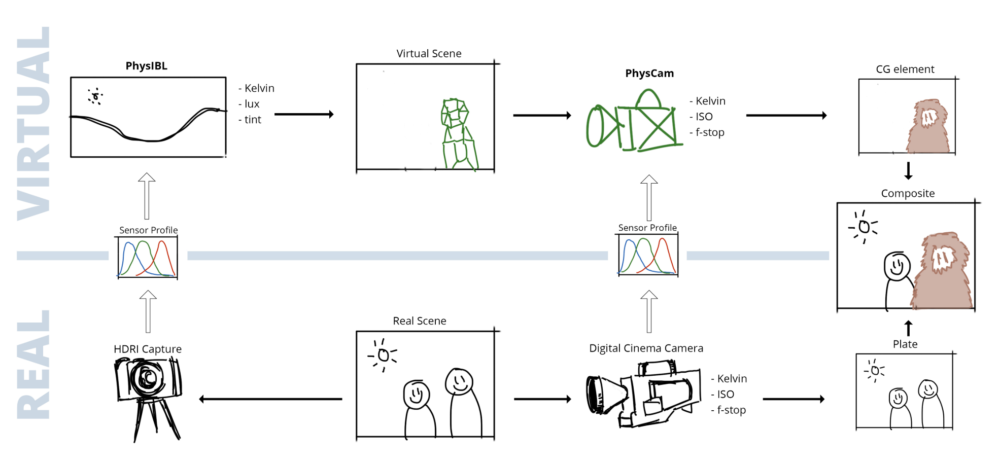
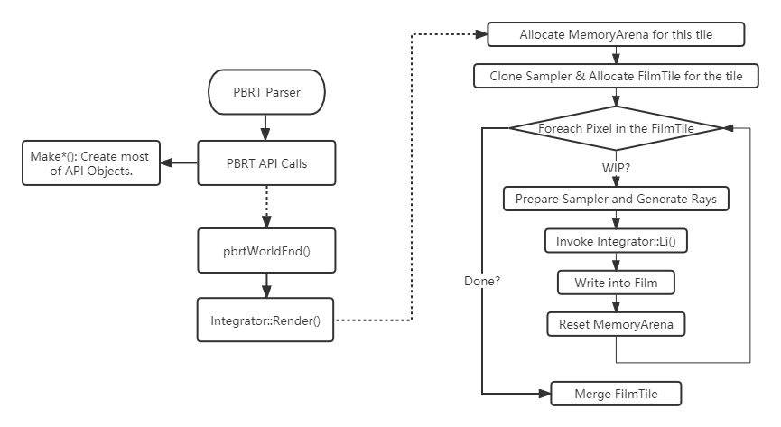
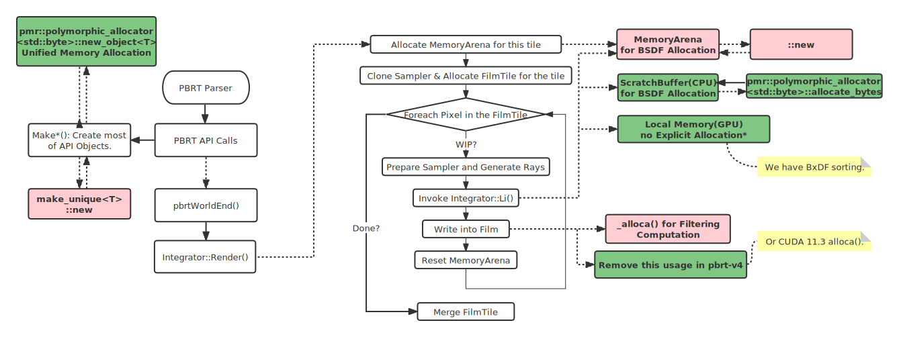
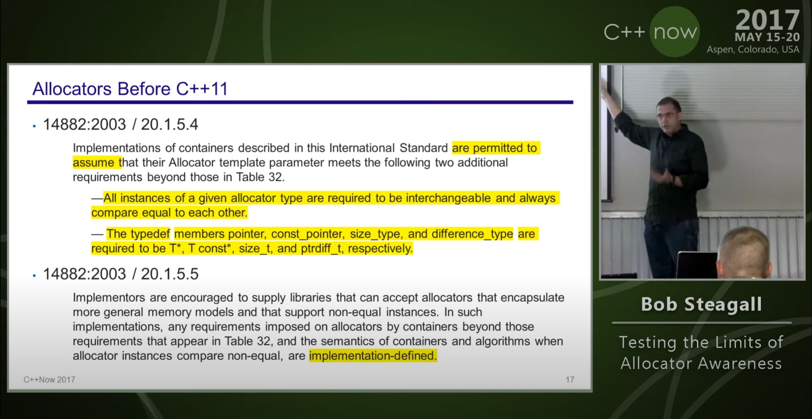
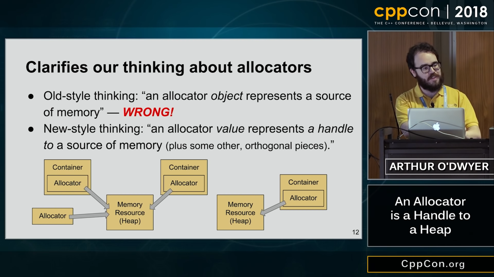
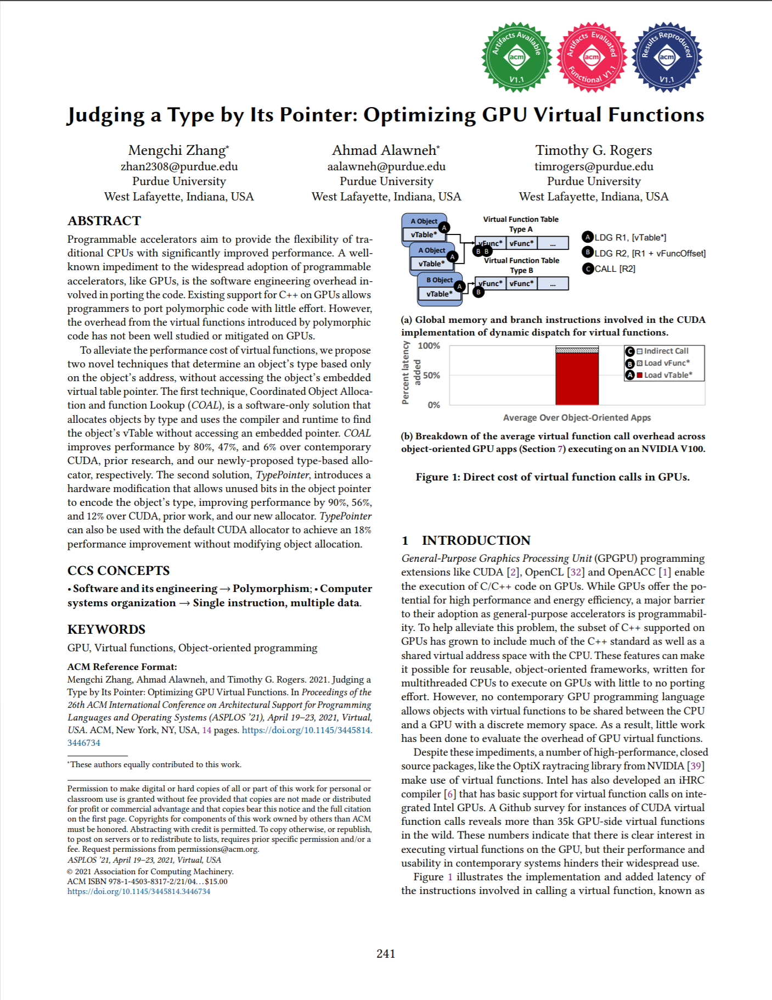
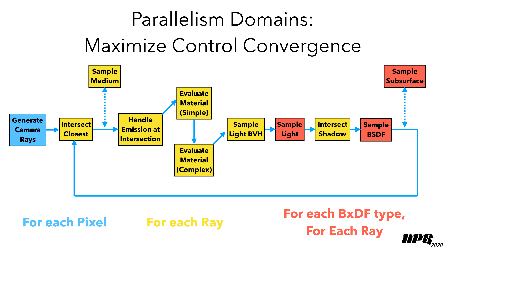
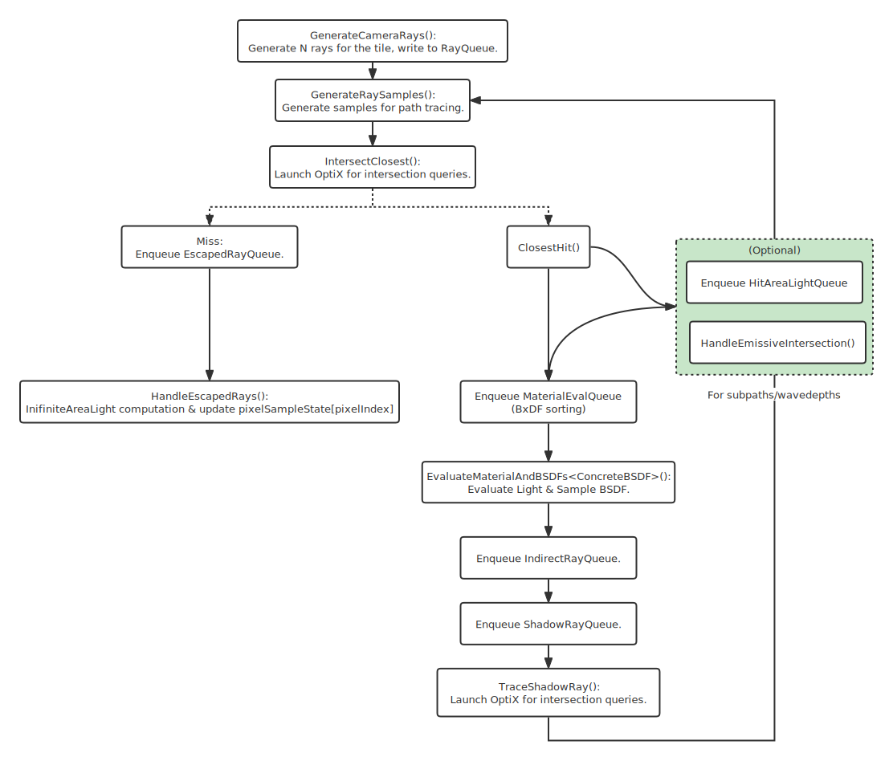

<!---

-->

<style scoped>section { font-size: 33px; }</style>

# **Porting pbrt to the GPU <br /> While Preserving its Soul?**
*An Engineer's Look on the Architecture of pbrt-v4 for GPU Ray Tracing*  

[]()
[]()

Zihong Zhou
10 May 2022

---

# Target Audience
 * To learn something in modern C++
 * Already know about path tracing 
   * But want to see an efficient implementation on GPU
 * Already have some experience with pbrt-v2/v3
   * And want to look at pbrt-v4


---

# Why Yet Another Talk on pbrt-v4

Talk/Blog(s) on pbrt-v4 by Matt Pharr:
 - [HPG 2020: Porting pbrt to the GPU while Preserving its Soul](https://pharr.org/matt/assets/pbrt-gpu-hpg2020.pdf)

---

# Why Yet Another Talk on pbrt-v4


---

# Why Yet Another Talk on pbrt-v4
Talk/Blog(s) on pbrt-v4 by Matt Pharr:
 - [HPG 2020: Porting pbrt to the GPU while Preserving its Soul](https://pharr.org/matt/assets/pbrt-gpu-hpg2020.pdf)
 - [pbrt-v4 code walkthrough](https://www.youtube.com/watch?v=AXuk7bmhZ2g)

---

# Why Yet Another Talk on pbrt-v4


---

# Why Yet Another Talk on pbrt-v4
Talk/Blog(s) on pbrt-v4 by Matt Pharr:
 - [HPG 2020: Porting pbrt to the GPU while Preserving its Soul](https://pharr.org/matt/assets/pbrt-gpu-hpg2020.pdf)
 - [pbrt-v4 code walkthrough](https://www.youtube.com/watch?v=AXuk7bmhZ2g)

---

# Why Yet Another Talk on pbrt-v4
Talk/Blog(s) on pbrt-v4 by Matt Pharr:
  - [HPG 2020: Porting pbrt to the GPU while Preserving its Soul](https://pharr.org/matt/assets/pbrt-gpu-hpg2020.pdf)
 - [pbrt-v4 code walkthrough](https://www.youtube.com/watch?v=AXuk7bmhZ2g)
 - [An early release of pbrt-v4 and some notes about pbrt-gpu](https://pharr.org/matt/blog/2020/08/19/pbrt-v4-released)

Ours:
 * More (hidden) details on the GPU implementation.
 * Ease pain on getting started.

---

## Topics We will Cover...

 ✔pbrt review.

 ✔*Porting pbrt to the GPU while Preserving its Soul*, How exactly?

 ✔Nitty-gritty in C++17 and CUDA.

 ✔Inspirations.

 ❌Rendering Algorithms (except for an overview of path tracing).

---
<style scoped>section { font-size: 32px; }</style>

# Outline
* Why pbrt?
* Overview of pbrt's architecture
* Porting pbrt to GPU, how?
  * Overview
  * How to make "core" runnable on GPU?
  * What about data structures/libraries?
  * How to coordinate with heterogeneous memory model?
  * What about virtual functions?
  * Launching GPU kernels?
* Recap

---

# Disclaimer

 * Still need to read pbrt afterwards*:confused:.
 * Opinions are my own:eyes:.
 * I can make mistakes:sweat_smile:. 

*We talk about the tip of the iceberg.
*Image Courtesy of pixabay at https://pixabay.com/photos/iceberg-climate-ice-glacier-6966784/.*

---
<style scoped>section { font-size: 32px; }</style>

# Outline
- **Why pbrt?**
- Overview of pbrt's architecture
- Porting pbrt to GPU, how?
  - Overview
  - How to make "core" runnable on GPU?
  - What about data structures/libraries?
  - How to coordinate with heterogeneous memory model?
  - What about virtual functions?
  - Launching GPU kernels?
- Recap

---

# Why pbrt?
 * Reference textbook for state-of-the-art rendering algorithms.
 * Clearly structured and goes from theory to implementation.
 * We are their target audience:
   - *Our final audience is **software developers in industry**. Although many of the ideas in this book will likely be familiar to this audience, seeing explanations of the algorithms presented in the literate style may provide new perspectives.* -- pbrt-v3, Preface.

 * LuxCoreRender is a production renderer based on pbrt*.
---

# <!-- fit --> pbrt's Target Audience: software developers in industry

 * Changes between pbrt-v2 and pbrt-v3:
   * Rendering Algorithms: BDPT/MLT/SPPM, Subsurface Scttering and Participating Media, Fourier BSDFs etc, Sobol Sampler etc.
   * Geometries: Curve Shape.
   * Realistic Camera Model.
   * Numerically robust floating-point arithmetic.
   * Lex & Yacc parser changed to C++ parser.
   * C++11: Reference Counting->std::shared_ptr, Lambda etc, move semantics etc.

---

# <!-- fit --> pbrt's Target Audience: software developers in industry
 * Book branch
   * follow the textbook.
 * texcache branch
   * texture cache implementation.
 * master branch 
   * C++ changes (towards practical usage). 
   * many-light sampling, practical fiber shading model etc.

---

# pbrt Towards Production Changes

 * Changes between pbrt-v3 and pbrt-v4:
   * Rendering Algorithms: Spectral Rendering, Modern Volumetric Scattering, More BxDFs, Measured and Layered BSDFs, Many-light Sampling, Blue-noise Sobol Sampler.
   * *PhysLights* from Weta Digital.
     * **VFX production workflow** to reconstruct SPD of a *real shot* and perform rendering in physical units.

---
Image courtesy of [Langlands and Fascione 2020](https://dl.acm.org/doi/10.1145/3388767.3407368)


---

# pbrt Towards Production Changes

 * Changes between pbrt-v3 and pbrt-v4:
   * Rendering Algorithms: Spectral Rendering, Modern Volumetric Scattering, More BxDFs, Measured and Layered BSDFs, Many-light Sampling, Blue-noise Sobol Sampler.
   * *PhysLights* from Weta Digital.
   * *RTX-Accelerated GPU Rendering and Wavefront Path Tracer*.
   * GBufferFilm/AOVs output.
   * *ptex* from Disney.

---


# How Far is pbrt from Production?

 * Performance over Clarity
   * Think about SSE/ISPC code.
 * ASWF Ecosystem: OpenColorIO, OpenVDB, OSL, MaterialX, etc.
 * Subdivision (OpenSubdiv) and Displacement mapping*.
   * Open problems in production for BDPT.
   * On-the-fly subdivision/Micropolygon Preprocessing (Manuka).
 * DCC Plugins or OpenUSD/Hydra Delegate.
 * Textures as programs: OpenShadingLanguage/MDL.

---

# How Far is pbrt from Production?

 * Nested Volumes.
 * AOV/LPE.
 * Out-of-core Rendering*.
 * (Multi-)C/G/XPU Rendering.
 * Denoising.
 * Statistics/Profiling.

---

# pbrt with Moana Island?!

*Image courtesty of Matt Pharr's blog* [*Swallowing the elephant*](https://pharr.org/matt/blog/2018/07/08/moana-island-pbrt-1).

---
<style scoped>section { font-size: 32px; }</style>

# Outline
- Why pbrt?
- **Overview of pbrt's architecture**
- Porting pbrt to GPU, how?
  - Overview
  - How to make "core" runnable on GPU?
  - What about data structures/libraries?
  - How to coordinate with heterogeneous memory model?
  - What about virtual functions?
  - Launching GPU kernels?
- Recap

---

# pbrt's Execution Flow*



*Almost the same for pbrt-v3 and pbrt-v4.

---

# pbrt-v3: Source Group

<style scoped>
table {
    height: 50%;
    width: 45%;
    font-size: 19px;
}
</style>

| Directory: src/ |     Base Class    |
|---------------|:-----------------|
|   accelerators  |     `Aggregate`     |
|     cameras     |       `Camera`      |
|     filters     |       `Filter`      |
|   integrators   |     `Integrator`    |
|      lights     |       `Light`       |
|    materials    |      `Material`     |
|      media      |       `Media`       |
|     samplers    |      `Sampler`      |
|      shapes     |       `Shape`       |
|     textures    |      `Texture`      |
|       core      | Base class  Utils |
|       ext       |    External lib   |
|       main      |      pbrt CLI     |
|      tests      |     Unit tests    |
|      tools      |     Converters    |

---

# pbrt-*v4*: Source Group

<style scoped>
table {
    height: 60%;
    width: 80%;
    font-size: 25px;
}
</style>


| Directory |     Base Class    |
|---------------|:-----------------|
|     ./src/pbrt     |   Derived Classes + Tests + pbrt CLI      |
|     **./src/pbrt/cpu**     |       **CPU Aggregates + Renderer + Integrators**      |
|   **./src/pbrt/gpu**   |     **GPU Aggregates(OptiX) + Memory**    |
|      **./src/pbrt/wavefront**     |       **Wavefront Integrator**       |
|       core->./src/pbrt/base      | Base classes |
|       core->./src/pbrt/utils      | Utilities |
|       ext->./ext       |    External lib   |
|      tools->./src/pbrt/cmd      |     Converters    |

---
<style scoped>section { font-size: 32px; }</style>

# Outline
- Why pbrt?
- Overview of pbrt's architecture
- **Porting pbrt to GPU, how?**
  - **Overview**
  - How to make "core" runnable on GPU?
  - What about data structures/libraries?
  - How to coordinate with heterogeneous memory model?
  - What about virtual functions?
  - Launching GPU kernels?
- Recap

---

# How to Port pbrt to GPU?

Before diving into pbrt-v4's GPU implementation, consider:
 * How to make "core" runnable on GPU?
 * How to deal with data structures/libaries?
   * STL implementation.
 * How to coordinate with heterogeneous memory model?
   * malloc/new on CPU cannot pass to GPU*
     * Linux HMM (Heterogeneous Memory Management).
   * Malloc/new in kernel is super slow.

---

# How to Port pbrt to GPU?

Before diving into pbrt-v4's GPU implementation, consider:
 * How to coordinate with heterogeneous memory model?
   * (SOA) Data layouts for coalescing memory access.
 * Different architecture for CPU and GPU.
 * ......

---
<style scoped>section { font-size: 32px; }</style>

# Outline
- Why pbrt?
- Overview of pbrt's architecture
- Porting pbrt to GPU, how?
  - Overview
  - **How to make "core" runnable on GPU?**
  - What about data structures/libraries?
  - How to coordinate with heterogeneous memory model?
  - What about virtual functions?
  - Launching GPU kernels?
- Recap

---

# How to make "core" runnable on GPU?

<style scoped>section { font-size: 28px; }</style>

Recall:
 - `__device__` == called by ==> `__global__/__kernel__`
 - `__host__` == called by ==> Host
 - `__global__` == called by ==> Host but invoked on device, cannot be member functions.

pbrt Annotations:
 * `PBRT_CPU_GPU` maps to `__host__ __device__`
 * `PBRT_GPU` maps to `__device__`
 * `?` maps to `__global__`

---

```cpp
class BSDF {
  public:
    // CPU Only.
    BSDF() = default;

    // CPU && GPU.
    PBRT_CPU_GPU
    BSDF(Normal3f ns, Vector3f dpdus, BxDF bxdf)
        : bxdf(bxdf), shadingFrame(Frame::FromXZ(Normalize(dpdus), Vector3f(ns))) {}

    PBRT_CPU_GPU
    operator bool() const { return (bool)bxdf; }
    PBRT_CPU_GPU
    BxDFFlags Flags() const { return bxdf.Flags(); }

    PBRT_CPU_GPU
    Vector3f RenderToLocal(Vector3f v) const { return shadingFrame.ToLocal(v); }
    PBRT_CPU_GPU
    Vector3f LocalToRender(Vector3f v) const { return shadingFrame.FromLocal(v); }
}

```

<style scoped>section { font-size: 26px; }</style>

⚠ Mixing CPU && GPU code in one place.

---
<style scoped>section { font-size: 32px; }</style>

# Outline
- Why pbrt?
- Overview of pbrt's architecture
- Porting pbrt to GPU, how?
  - Overview
  - How to make "core" runnable on GPU?
  - **What about data structures/libraries?**
  - How to coordinate with heterogeneous memory model?
  - What about virtual functions?
  - Launching GPU kernels?
- Recap

---

# <!--fit--> What about Data Structures/Libraries?

STL: std::vector/array/optional on GPU?

 * NVCC: `expt-relaxed-constexpr` to enable constexpr `__host__` functions to be called in `__device__` (or the other way around)*.
   * constexpr <algorithm> for std::max (C++14), std::max_element (C++17) etc.
   * constexpr <functional> std::plus<T> etc.
   * constexpr std::array.

*<cmath> functions within STL are a bit different.
*`std::initializer_list` is a bit different. Refer to [I.4.20.2.](https://docs.nvidia.com/cuda/cuda-c-programming-guide/index.html#initializer-list)

---

# <!--fit--> What about Data Structures/Libraries?

STL: std::vector/array/optional on GPU?
 - NVCC: `expt-relaxed-constexpr` to enable constexpr `__host__` functions to be called in `__device__` (or the other way around).
 - (pbrt-v4) Reinvent the wheels! pstd::array, pstd::vector etc.

---

```cpp
 template <typename T, int N>                        PBRT_CPU_GPU                                        
 class array {                                       iterator begin() { return values; }                 
   public:                                           PBRT_CPU_GPU                                        
     using value_type = T;                           iterator end() { return values + N; }               
     using iterator = value_type *;                  PBRT_CPU_GPU                                        
     using const_iterator = const value_type *;      const_iterator begin() const { return values; }     
     using size_t = std::size_t;                     PBRT_CPU_GPU                                        
 　                                                  const_iterator end() const { return values +   N; } 
     array() = default;                          　                                                      
 　                                                  PBRT_CPU_GPU                                        
     /*--no-host-device-initializer-list.*/          size_t size() const { return N; }                   
     PBRT_CPU_GPU                                　                                                      
     array(std::initializer_list<T> v) {             PBRT_CPU_GPU                                        
         size_t i = 0;                               T   &operator[](size_t i) { return values[i]; }     
         for (const T &val : v)                  　                                                      
               values[i++] = val;                    PBRT_CPU_GPU                                        
     }                                               T   *data() { return   values; }                    
 　                                                  ...                                                 
     PBRT_CPU_GPU                                　                                                      
     void fill(const T &v) {                       private:                                              
         for (int i = 0; i < N; ++i)                 T values[N] = {};                                   
               values[i] = v;                    }                                                       
     }        
```

---

# <!--fit--> What about Data Structures/Libraries?

STL: std::vector/array/optional on GPU?
 - NVCC: `expt-relaxed-constexpr` to enable constexpr `__host__` functions to be called in `__device__` (or the other way around).
 - (pbrt) Reinventing the wheels*! pstd::array, pstd::vector etc.
 - External libraries: libcu++, thrust etc.

*These containers are redesigned to be compatible with `polymorphic_allocator`.

---

# libcu++, thrust
* Thrust: Parallel STL library for CUDA C++.
  * Algorithms w/ iterators: sorting, searching, copying etc.
  * Containers: host_vector, device_vector and universal_vector (since V1.12.0).
  * Utilities: pair, tuple and type_traits.
  * Memory allocators.
* libcu++
  * Complementary to Thrust: atomics/synchronization and utilities.
  * Support array since V1.8.0 (yet to be included in CUDA SDK).

---

# <!--fit--> Example: cuda::std::array instead of pstd::array

```cpp
template<typename ArrayType, size_t ArraySize>
__global__ void libcuTest(cuda::std::array<ArrayType, ArraySize> x,
                          cuda::std::array<ArrayType, ArraySize> y) {
    for (int i = 0; i < ArraySize; i++) {
        printf("--: %d\n", std::plus<ArrayType>()(x[i], y[i]));
    }
}

int main(){
  cuda::std::array<int, 5> arrayX;
  arrayX.fill(10);
  cuda::std::array<int, 5> arrayY;
  arrayY.fill(20);
  libcuTest<decltype(arrayX)::value_type, arrayX.size()> <<<1, 1>>> (arrayX, arrayY);
  return 0;
}
```

---

# <!--fit--> What about Data Structures/Libraries?

Lessons learned:
 * No perfect solutions (yet).
 * `expt-relaxed-constexpr` could help, but not too much...
 * NVIDIA's thrust and libcu++ are useful, but no `optional` support so far (on the road).
 * Write your own implementations inspired by Google's abseil, Meta's folly etc.

---
<style scoped>section { font-size: 32px; }</style>

# Outline
- Why pbrt?
- Overview of pbrt's architecture
- Porting pbrt to GPU, how?
  - Overview
  - How to make "core" runnable on GPU?
  - What about data structures/libraries?
  - **How to coordinate with heterogeneous memory model?**
  - What about virtual functions?
  - Launching GPU kernels?
- Recap

---

# <!--fit-->  How to coordinate with heterogeneous memory model?

Recall memory allocation at host side:
 * `new/malloc`*.
 * `ThreadPool`, `MemoryArena` etc.
 * `alloca()`.

---
<style scoped>section { font-size: 33px; }</style>
# <!--fit-->  How to coordinate with heterogeneous memory model?

Recall memory allocation at device side:
 * Linear memory (UVA for 64-bit application, >= CC 2.0 devices).
   * Device memory: `cudaMalloc{Pitch|3D}`.
   * Pageable host memory w/ transfer: `new/malloc` + `cudaMemcpy{2D|3D}`.
   * Pinned host memory w/ transfer: `cudaHostAlloc(cudaHostAllocDefault)`.
   * Zero-copy memory: `cudaHostAlloc(cudaHostAllocMapped)`
   * Unified memory: `cudaMallocManaged()`.
 * CUDA arrays for texture fetching.

---

# <!--fit--> Where are the memory allocations happening?



---

# <!--fit--> Where are the memory allocations happening?

 * Local memory/Stack variables are allocated by compiler. 
   * No need to worry about. :smiley:
 * Amost all dynamic allocations happen before rendering.
   * Allocate on the host and copy to the device.
   * Avoid dynamic memory allocations on the fly.
     * Though you can new/malloc/alloca in device code.
   * Special memory allocations may be available, e.g. `ALLOCA()`.
---

# <!--fit--> Using allocators to allocate memory for heterogeneous memory resources.

We need to abstract different types of memory allocations.
 * `std::allocator<T>` is useful but...
   * Before C++11, allocator must be stateless.
   *  [CppNow 2017](https://www.youtube.com/watch?v=fmJfKm9ano8).
  
---

# <!--fit--> *Using allocators to allocate memory for heterogeneous memory resources.

We need to abstract different types of memory allocations.
 * `std::allocator<T>` helps but it is [*one of the most mysterious parts of namespace std, as well as one of the more flexible parts*](https://rawgit.com/google/cxx-std-draft/allocator-paper/allocator_user_guide.html).
   * Before C++11, allocator must be stateless.
   * Since C++11, allocator could be stateful leveraging `allocator_traits` but it is tremendously difficult to implement.
     * Pointer traits (for fancy/synthetic pointer)
     * Template rebinding (for containers such as linked list).
     * Propagation for copy, move, swap (POCCA/POCMA/POCS).
     * Deep propagation (`std::scoped_allocator_adaptor`).

---

# <!--fit--> Using allocators to allocate memory for heterogeneous memory resources.

We need to abstract different types of memory allocations.
 * `std::pmr::polymorphic_allocator` supports a simpler allocator model for library authors and users since C++17.
   *  [CppCon 2018](https://www.youtube.com/watch?v=IejdKidUwIg)
---
<style scoped>section { font-size: 28px; }</style>
pbrt-v4 reinvented the wheels though in `pstd` namespace:

```cpp
namespace pstd{
class memory_resource {
  public:
    virtual ~memory_resource();
    void *allocate(size_t bytes, size_t alignment = max_align) {
        return do_allocate(bytes, alignment);
    }
    void deallocate(void *p, size_t bytes, size_t alignment = max_align) {
        return do_deallocate(p, bytes, alignment);
    }
    bool is_equal(const memory_resource &other) const noexcept {
        return do_is_equal(other);
    }

  private:
    virtual void *do_allocate(size_t bytes, size_t alignment) = 0;
    virtual void do_deallocate(void *p, size_t bytes, size_t alignment) = 0;
    virtual bool do_is_equal(const memory_resource &other) const noexcept = 0;
};
} // namespace pstd
```

---
<style scoped>section { font-size: 28px; }</style>

pbrt-v4 uses unified memory* for CUDA memory resource.

```cpp
class CUDAMemoryResource : public pstd::pmr::memory_resource {
    void *do_allocate(size_t size, size_t alignment){
      void *ptr;
      CUDA_CHECK(cudaMallocManaged(&ptr, size));
      CHECK_EQ(0, intptr_t(ptr) % alignment);
      return ptr;
    }
    void do_deallocate(void *p, size_t bytes, size_t alignment){
      CUDA_CHECK(cudaFree(p));
    }

    bool do_is_equal(const memory_resource &other) const noexcept {
        return this == &other;
    }
};
```

*Unified Memory: one single pointer for host and device access. No more `cudaMemcpy()` calls, CUDA runtime does this automatically for developers.

---
<style scoped>section { font-size: 28px; }</style>

```cpp
using Allocator = polymorphic_allocator<std::byte>;

template <class Tp = std::byte>
class polymorphic_allocator {
  public:
    using value_type = Tp;

    polymorphic_allocator() noexcept { memoryResource = new_delete_resource(); }
    polymorphic_allocator(memory_resource *r) : memoryResource(r) {}
    memory_resource *resource() const { return memoryResource; }

    // member functions
    [[nodiscard]] Tp *allocate(size_t n) {
        return static_cast<Tp *>(resource()->allocate(n * sizeof(Tp), alignof(Tp)));
    }
    void deallocate(Tp *p, size_t n) { resource()->deallocate(p, n); }

    void *allocate_bytes(size_t nbytes, size_t alignment = alignof(max_align_t));
    void deallocate_bytes(void *p, size_t nbytes,
                          size_t alignment = alignof(std::max_align_t));
```

---
<style scoped>section { font-size: 28px; }</style>

```cpp
    template <class T>
    T *allocate_object(size_t n = 1);
    template <class T>
    void deallocate_object(T *p, size_t n = 1);
    template <class T, class... Args>
    T *new_object(Args &&...args) {
        // NOTE: this doesn't handle constructors that throw exceptions...
        T *p = allocate_object<T>();
        construct(p, std::forward<Args>(args)...);
        return p;
    }
    template <class T>
    void delete_object(T *p);

    template <class T, class... Args>
    void construct(T *p, Args &&...args) {
        ::new ((void *)p) T(std::forward<Args>(args)...);
    }

    template <class T>
    void destroy(T *p) {
        p->~T();
    }
  private:
    memory_resource *memoryResource;
};
```

---
# <!--fit-->*FYI: Thrust has a bit different implementation that may benefit CUDA applications.

 * The high-level idea is still the same as C++17.
 * Opt-in type erasure for `memory_resource` implementation as opposed to dynamic dispatch by default.
 * Better implementation for `(un)synchronized_pool_resource`.
   * More tuning parameters for the pool.
   * Bookkeeping memory allocation separated to avoid memory migration back and forth.

Reference: 
[Memory Resources in a Heterogeneous World](https://www.youtube.com/watch?v=5UVeh4_5B8I) at CppCon 2019.

---
<style scoped>section { font-size: 28px; }</style>
# <!--fit-->Recall: Where are the memory allocations happening?

```cpp
PointLight *PointLight::Create(const Transform &renderFromLight, Medium medium,
                               const ParameterDictionary &parameters,
                               const RGBColorSpace *colorSpace, const FileLoc *loc,
                               Allocator alloc) {
    Spectrum I = parameters.GetOneSpectrum("I", &colorSpace->illuminant,
                                           SpectrumType::Illuminant, alloc);
    Float sc = parameters.GetOneFloat("scale", 1);
    Float phi_v = parameters.GetOneFloat("power", -1);

    ...

    return alloc.new_object<PointLight>(finalRenderFromLight, medium, I, sc);
}
```

`PointLight::Create()` is neither `PBRT_CPU_GPU` nor `PBRT_GPU`! It could only be invoked on the CPU side; recall:
 * Amost all dynamic allocations happen before rendering.

---
<style scoped>section { font-size: 28px; }</style>
# <!--fit--> How is `PointLight` looks like really?

This is what `PointLight` like in pbrt-v3:

```cpp
class PointLight : public Light {
  public:
    PointLight(const Transform &LightToWorld,
               const MediumInterface &mediumInterface, const Spectrum &I);
    Spectrum Sample_Li(const Interaction &ref, const Point2f &u, Vector3f *wi,
                       Float *pdf, VisibilityTester *vis) const;
    Spectrum Power() const;
    Float Pdf_Li(const Interaction &, const Vector3f &) const;
    Spectrum Sample_Le(const Point2f &u1, const Point2f &u2, Float time,
                       Ray *ray, Normal3f *nLight, Float *pdfPos,
                       Float *pdfDir) const;
    void Pdf_Le(const Ray &, const Normal3f &, Float *pdfPos, Float *pdfDir) const;

  private:
    const Point3f pLight;
    const Spectrum I;
};
```

---
<style scoped>section { font-size: 32px; }</style>

# Outline
- Why pbrt?
- Overview of pbrt's architecture
- Porting pbrt to GPU, how?
  - Overview
  - How to make "core" runnable on GPU?
  - What about data structures/libraries?
  - How to coordinate with heterogeneous memory model?
  - **What about virtual functions?**
  - Launching GPU kernels?
- Recap

---

This is what `Light` like in pbrt-v3:

```cpp
class Light {
  public:
    virtual ~Light();
    Light(int flags, const Transform &LightToWorld, const MediumInterface &mediumInterface, int nSamples = 1);
    virtual Spectrum Sample_Li(const Interaction &ref, const Point2f &u, Vector3f *wi, Float *pdf,
                               VisibilityTester *vis) const = 0;
    virtual Spectrum Power() const = 0;
    virtual void Preprocess(const Scene &scene) {}
    virtual Spectrum Le(const RayDifferential &r) const;
    virtual Float Pdf_Li(const Interaction &ref, const Vector3f &wi) const = 0;
    virtual Spectrum Sample_Le(const Point2f &u1, const Point2f &u2, Float time, Ray *ray, 
    Normal3f *nLight, Float *pdfPos, Float *pdfDir) const = 0;
    virtual void Pdf_Le(const Ray &ray, const Normal3f &nLight, Float *pdfPos, Float *pdfDir) const = 0;
 
    const int flags;
    const int nSamples;
    const MediumInterface mediumInterface;

  protected:
    const Transform LightToWorld, WorldToLight;
};
```

---

# What about virtual functions?

[CUDA C Programming Guide I.4.10.3](https://docs.nvidia.com/cuda/cuda-c-programming-guide/index.html#virtual-functions):
*It is not allowed to pass as an argument to a __global__ function an object of a class with virtual functions.
If an object is created in host code, invoking a virtual function for that object in device code has undefined behavior.
If an object is created in device code, invoking a virtual function for that object in host code has undefined behavior.*

This is *incompatible* with our paradigm: *allocating object with virtual functions in the host and passed it to the device side*.

---

# What about virtual functions?

[CUDA C Programming Guide I.4.10.3](https://docs.nvidia.com/cuda/cuda-c-programming-guide/index.html#virtual-functions):
*It is not allowed to pass as an argument to a __global__ function an object of a class with virtual functions.
If an object is created in host code, invoking a virtual function for that object in device code has undefined behavior.
If an object is created in device code, invoking a virtual function for that object in host code has undefined behavior*.*

*Caveat: Why? It is perfectly fine if an object is created in device code and you could invoke virtual dispatch in kernel.

---

# <!--fit--> What about virtual functions?

Virtual dispatch on GPU is not recommended anyway and we need some [solutions](https://engineering.purdue.edu/tgrogers/papers/zhang.asplos2021.pdf).


---

# What about virtual functions?

Possible solutions:
 * No virtual and plain switch-case based on type (cycles, luxcore).
 * Variant/TaggedUnion.
   * cuda::std::variant is not yet implemented in libcu++ ([#162](https://github.com/NVIDIA/libcudacxx/issues/162)).
   * *[C++ Compile Time Polymorphism for Ray Tracing](https://diglib.eg.org/handle/10.2312/vmv20171268)*.
 * CRTP Compile Time Polymorphism.
 * TaggedPtr (pbrt-v4).

---

# TaggedPtr

Stems from *vtable hacks* for rendering Disney's *Moana* island scene.

*Each triangle in the scene carries an overhead of at least two vtable pointers: one for its Triangle and one for its SimplePrimitive. That’s 16 bytes. The Moana island scene has a total of 146,162,124 unique triangles, which adds up to almost 2.2 GB of highly-redundant vtable pointers.* -- [Swallowing the elephant (part 5) by Matt Pharr](https://pharr.org/matt/blog/2018/07/16/moana-island-pbrt-5).

x86 CPUs today only use 48 bits of 64-bit addressing space for pointers.
See also: [CUDA C Programming Guide 3.2.2. Device Memory](https://docs.nvidia.com/cuda/cuda-c-programming-guide/index.html#device-memory).

---

# pbrt-v4's TaggedPtr

Builds on [Meta/Folly's DiscriminatedPtr](https://github.com/facebook/folly/blob/main/folly/DiscriminatedPtr.h), at *taggedptr.h*

```cpp
template <typename... Ts>
class TaggedPointer {
  public:
    PBRT_CPU_GPU unsigned int Tag() const { return ((bits & tagMask) >> tagShift); }
    PBRT_CPU_GPU void *ptr() { return reinterpret_cast<void *>(bits & ptrMask); }
    ...
    
  private:
    static constexpr int tagShift = 57;
    static constexpr int tagBits = 64 - tagShift;
    static constexpr uint64_t tagMask = ((1ull << tagBits) - 1) << tagShift;
    static constexpr uint64_t ptrMask = ~tagMask;
    uintptr_t bits = 0;
```

---

```cpp
  public:
    template <typename F>
    PBRT_CPU_GPU decltype(auto) Dispatch(F &&func) {
        DCHECK(ptr());
        using R = typename detail::ReturnType<F, Ts...>::type;
        return detail::Dispatch<F, R, Ts...>(func, ptr(), Tag() - 1);
    }

    template <typename F>
    decltype(auto) DispatchCPU(F &&func) {
        DCHECK(ptr());
        using R = typename detail::ReturnType<F, Ts...>::type;
        return detail::DispatchCPU<F, R, Ts...>(func, ptr(), Tag() - 1);
    }
}
```

*Note that there is a bug related to variadic template in their `detail::Dispatch<>()` implementation (See the next slide).

---
```cpp
template <typename F, typename R, typename T0, typename T1, typename T2, typename T3,
          typename T4, typename T5, typename T6, typename T7, typename... Ts>
auto DispatchCPU(F &&func, const void *ptr, int index) {
    switch (index) {
    case 0:
        return func((const T0 *)ptr);
    case 1:
        return func((const T1 *)ptr);
    ...
    default:
        return DispatchCPU<F, R, Ts...>(func, ptr, index - 8);
    }
}
```
 * Note that parameter pack could contain zero parameter in which case we suffer from ambiguous function calls.
   * Could be solved by `SFINAE` so I opened a [PR#253](https://github.com/mmp/pbrt-v4/pull/253).

---

# <!--fit--> Replace virtuals with TaggedPtr: Step 1: Remove virtuals.

This is what `Light` base class like in pbrt-**v4**:

```cpp
class Light : public TaggedPointer<PointLight, DistantLight, DiffuseAreaLight> {
  public:
    using TaggedPointer::TaggedPointer;

    static Light Create(const std::string &name, const ParameterDictionary &parameters,
                        const Transform &renderFromLight,
                        const CameraTransform &cameraTransform, Medium outsideMedium,
                        const FileLoc *loc, Allocator alloc);
    PBRT_CPU_GPU inline LightType Type() const;
    std::string ToString() const;
    PBRT_CPU_GPU void PDF_Le(const Ray &ray, Float *pdfPos, Float *pdfDir) const;
    ...
};
```

---

`PointLight` inherits from `LightBase`:

```cpp
class PointLight : public LightBase {
  public:
    PointLight(Transform renderFromLight, MediumInterface mediumInterface, Spectrum I, Float scale);

    static PointLight *Create(const Transform &renderFromLight, Medium medium,
                              const ParameterDictionary &parameters,
                              const RGBColorSpace *colorSpace, const FileLoc *loc,
                              Allocator alloc);
    std::string ToString() const;
    PBRT_CPU_GPU void PDF_Le(const Ray &, Float *pdfPos, Float *pdfDir) const;
    ...
    
  private:
    const DenselySampledSpectrum *I;
    Float scale;
};
```

---
# <!--fit--> Replace virtuals with TaggedPtr: Step 2: Add "templated" Dispatch calls.

```cpp
void Light::PDF_Le(const Ray &ray, Float *pdfPos, Float *pdfDir) const {
    auto pdf = [&](auto ptr) { return ptr->PDF_Le(ray, pdfPos, pdfDir); };
    return Dispatch(pdf);
}

SampledSpectrum Light::Phi(SampledWavelengths lambda) const {
    auto phi = [&](auto ptr) { return ptr->Phi(lambda); };
    return DispatchCPU(phi);
}

void Light::Preprocess(const Bounds3f &sceneBounds) {
    auto preprocess = [&](auto ptr) { return ptr->Preprocess(sceneBounds); };
    return DispatchCPU(preprocess);
}
```

---
```cpp
class LightBase {
  public:
    LightBase(LightType type, const Transform &renderFromLight, const MediumInterface &mediumInterface);

    PBRT_CPU_GPU LightType Type() const { return type; }

    PBRT_CPU_GPU
    SampledSpectrum L(Point3f p, Normal3f n, Point2f uv, Vector3f w,
                      const SampledWavelengths &lambda) const {
        return SampledSpectrum(0.f);
    }

    PBRT_CPU_GPU
    SampledSpectrum Le(const Ray &, const SampledWavelengths &) const {
        return SampledSpectrum(0.f);
    }

  protected:
    LightType type;
    ...
};
```


---

# Replace virtuals with TaggedPtr.

Caveat/Problems:
 * `Light` must know all possible "Derived" light types.
 * No more virtual calls! But no more `override` checks!
 * `Light` was named `LightHandle` before, which becomes an handle.
   * `Light` is a handle while `PointLight` is not!
   * Weird `L()` and `Le()` in `LightBase`.
 * Some fields are not accessible from GPU, e.g. `std::string`.

---
<style scoped>section { font-size: 28px; }</style>
# <!--fit--> Example: Memory allocations for pointlights (pseudocode).

1. Allocate memory for `PointLight` via polymorphic allocator: 
```cpp
PointLight* pPointLight = alloc.new_object<PointLight>(...);
```
2. Obtain/Construct a `Light` (Light handle in essence) from `PointLight`:
```cpp
Light pLightHandle{pPointLight};
```
3. Use the `Light` in kernel to access data/tagged dispatch:
```cpp
PBRT_CPU_GPU void LightSampling(...){
  ...
  pstd::optional<LightLiSample> ls = pLightHandle.SampleLi(...); // Invoke tagged dispatch (runtime polymorphism).
  if (!ls || !ls->L || ls->pdf == 0)
    return;
  ...
}
```

---
<style scoped>section { font-size: 32px; }</style>

# Outline
- Why pbrt?
- Overview of pbrt's architecture
- Porting pbrt to GPU, how?
  - Overview
  - How to make "core" runnable on GPU?
  - What about data structures/libraries?
  - How to coordinate with heterogeneous memory model?
  - What about virtual functions?
  - **Launching GPU kernels?**
- Recap

---

# Launching GPU kernels?

We have not seen `__global__` functions so far but `__device__` ...

 * Who launches GPU kernels?
   * Integrator/Renderer.
 * How many kernels do we need? In other words, one megakernel or lots of spilt wavefront/microkernels?
   * Trade-off launching costs and kernel efficiency.
     * Generally, *[Megakernel Considered Harmful...](https://research.nvidia.com/publication/2013-07_megakernels-considered-harmful-wavefront-path-tracing-gpus)*.
     * But not always, *[Dr.Jit: A Just-In-Time Compiler for Differentiable Rendering](https://arxiv.org/pdf/2202.01284.pdf)*.

---
<style scoped>section { font-size: 32px; }</style>
# <!--fit--> Still, wavefront path tracing is used ubiquitously in production.

Why?
 * GPU follows SIMT model:
   * 32 threads* in a warp executing together.
   * Concern about branch divergence.
 * High-bandwidth, high-latency memory model.
   * Need to expose enough parallelism with coherent memory access*.
 * Instruction caches are tend to be smaller.
   * A megakernel could run out of the instruction cache.
     * Could hurt latency hiding and suffers from register pressure.

---

# pbrt-v4: `WavefrontPathIntegrator`.
 * Core kernel code could be shared across CPU & GPU w/ PBRT_CPU_GPU annotation.
 * `WavefrontPathIntegrator` launches GPU kernels for volumetric path tracing.
   * OptiX as an intersection device for hardware intersection.
   * Ray generations, shading, filtering, film writing etc. as native CUDA kernels.

---


[HPG 2020: Porting pbrt to the GPU while Preserving its Soul](https://pharr.org/matt/assets/pbrt-gpu-hpg2020.pdf)

---



---
<style scoped>section { font-size: 28px; }</style>
# <!--fit--> Launching GPU kernels: Implementation for non-queued kernels

```cpp
template <typename F>
void ParallelFor(const char *description, int nItems, F &&func) {
  if (Options->useGPU)
    GPUParallelFor(description, nItems, func);
  ...
}

template <typename F>
__global__ void Kernel(F func, int nItems) {
    int tid = blockIdx.x * blockDim.x + threadIdx.x;
    func(tid); // func has a thread id.
}

template <typename F>
void GPUParallelFor(const char *description, int nItems, F func) {
    auto kernel = &Kernel<F>; // Getting address of a global kernel in host.
    int blockSize = GetBlockSize(description, kernel);
    int gridSize = (nItems + blockSize - 1) / blockSize;
    kernel<<<gridSize, blockSize>>>(func, nItems);
}
```

---
<style scoped>section { font-size: 28px; }</style>
# <!--fit--> Launching GPU kernels: Implementation for non-queued kernels

```cpp
template <typename ConcreteSampler>
void WavefrontPathIntegrator::GenerateCameraRays(int y0, int sampleIndex) {
    RayQueue *rayQueue = CurrentRayQueue(0);
    ParallelFor(
        "Generate camera rays", maxQueueSize, PBRT_CPU_GPU_LAMBDA(int pixelIndex) {
            // sampler is captured by value.
            ConcreteSampler pixelSampler = *sampler.Cast<ConcreteSampler>();
            CameraSample cameraSample = GetCameraSample(pixelSampler, pPixel, filter);
            pstd::optional<CameraRay> cameraRay = camera.GenerateRay(cameraSample, lambda);

            pixelSampleState.L[pixelIndex] = SampledSpectrum(0.f);
            rayQueue->PushCameraRay(cameraRay->ray, lambda, pixelIndex);
            ...
        });
}
```
`GenerateCameraRays()` will be executed in parallel on GPU!

---
<style scoped>section { font-size: 28px; }</style>
Definition of `PBRT_CPU_GPU_LAMBDA`:

```cpp
#define PBRT_CPU_GPU __host__ __device__
#ifdef PBRT_IS_WINDOWS
#define PBRT_CPU_GPU_LAMBDA(...) [ =, *this ] PBRT_CPU_GPU(__VA_ARGS__) mutable
#else
#define PBRT_CPU_GPU_LAMBDA(...) [=] PBRT_CPU_GPU(__VA_ARGS__)
#endif
```

Background information:
 * [CUDA device lambda](https://developer.nvidia.com/blog/new-compiler-features-cuda-8/) is supported since CUDA 8.
   * *In CUDA 7.5, you can define __device__ lambdas in host code and use them to instantiate __global__ function templates. CUDA 8  now also supports __host__ __device__ lambdas in __global__ template instantiations.  Since the lambda is marked __host__ __device__, it can be called from host code as well.  This is very useful because it allows you to make a runtime decision whether to execute a lambda on the GPU or the CPU.*

---
<style scoped>section { font-size: 28px; }</style>

```cpp
#define PBRT_CPU_GPU __host__ __device__
#ifdef PBRT_IS_WINDOWS
#define PBRT_CPU_GPU_LAMBDA(...) [ =, *this ] PBRT_CPU_GPU(__VA_ARGS__) mutable
#else
#define PBRT_CPU_GPU_LAMBDA(...) [=] PBRT_CPU_GPU(__VA_ARGS__)
#endif
```

Background information:
 - Need to capture `*this` by value. (Why?*)
   - C++17 supports [`*this` capture mode](https://en.cppreference.com/w/cpp/language/lambda).
     - Alternatively `[thisVal=*this]` in C++14.

*You cannot access host memory in device code in general.

---
<style scoped>section { font-size: 28px; }</style>
# <!--fit--> Launching GPU kernels: Implementation for *queued* kernels

```cpp
template <typename F, typename WorkItem>
void ForAllQueued(const char *desc, const WorkQueue<WorkItem> *q, int maxQueued, F &&func) {
    // Launch GPU threads to process _q_ using _func_
    GPUParallelFor(desc, maxQueued, [=] PBRT_GPU(int index) mutable {
      func((*q)[index]);
    });
}

template <typename F>
__global__ void Kernel(F func, int nItems) {
    int tid = blockIdx.x * blockDim.x + threadIdx.x;
    func(tid); // func has a thread id.
}

template <typename F>
void GPUParallelFor(const char *description, int nItems, F func) {
    auto kernel = &Kernel<F>; // Getting address of a global kernel in host.
    int blockSize = GetBlockSize(description, kernel);
    int gridSize = (nItems + blockSize - 1) / blockSize;
    kernel<<<gridSize, blockSize>>>(func, nItems);
}
```

---

# <!--fit--> Queued kernel example: HandleEscapedRays()

```cpp
void WavefrontPathIntegrator::HandleEscapedRays() {
    ForAllQueued(
        "Handle escaped rays", escapedRayQueue, maxQueueSize,
        PBRT_CPU_GPU_LAMBDA(const EscapedRayWorkItem w) {
            SampledSpectrum L(0.f);
            for (const auto &light : *infiniteLights) {
                ...Compute L...
            }
            L += pixelSampleState.L[w.pixelIndex]; // SOA
            pixelSampleState.L[w.pixelIndex] = L;
        });
}
```

---
<style scoped>section { font-size: 32px; }</style>

# Outline
* Why pbrt?
* Overview of pbrt's architecture
* Porting pbrt to GPU, how?
  * Overview
  * How to make "core" runnable on GPU?
  * What about data structures/libraries?
  * How to coordinate with heterogeneous memory model?
  * What about virtual functions?
  * Launching GPU kernels?
* **Recap**

---
# Recap

 - pbrt-v4 goodness (engineering perspective):
   - One universal piece of code works on CPU & GPU.
   - Modern C++17 w/ CUDA
     - Host/Device lambda
     - TaggedPtr for polymorphism
     - Unified memory with polymorphic allocators
       - "Stackless" material graph w/o SVM
     - libcu++ atomics
   - CUDA Runtime API

---
# Recap

 - pbrt-v4 weakness (engineering perspective):
   - Integrator still needs to be specialized on GPU
     - Only wavefront volumetric path tracing integrator yet
   - Modern C++17 w/ CUDA but heavy template based
     - Could be hard to use
     - Additional compile time overhead
   - Be aware of CPU & GPU programming model or segfault

---
# Further Reading
<style scoped>section { font-size: 28px; }</style>

CppCon at STL allocators:
 - [Memory Resources in a Heterogeneous World](https://www.youtube.com/watch?v=5UVeh4_5B8I)
 - [An Allocator is a Handle to a Heap](https://www.youtube.com/watch?v=IejdKidUwIg)
 - [Bringing Existing Code to CUDA Using constexpr and std::pmr](https://www.youtube.com/watch?v=hfIBHUTwwqQ)
 - [Allocators: The Good Parts](https://www.youtube.com/watch?v=v3dz-AKOVL8)
 - [How to Write a Custom Allocator](https://www.youtube.com/watch?v=kSWfushlvB8)
 - [Getting Allocators out of Our Way](https://www.youtube.com/watch?v=RLezJuqNcEQ)
 - [Testing the Limits of Allocator Awareness](https://www.youtube.com/watch?v=fmJfKm9ano8)
 - [An allocator model for std2](https://www.youtube.com/watch?v=oCi_QZ6K_qk)
 - [Local ('Arena') Memory Allocators (part 1 of 2)](https://www.youtube.com/watch?v=nZNd5FjSquk)

---
<style scoped>section { font-size: 30px; }</style>

# <!--fit--> What is left to be covered about this talk?
 - pbrt-v4 building (this is easy! :D)
 - Unified memory in depth and memory alignment
   - cuda texture
 - Better cuda programming options: CUDA-API-Wrappers, kat etc.
 - OptiX
 - Material implementation
   - procedural textures
   - mix material
 - containers.h implementations, `pstd::span`, `pstd::optional`, `pstd::tuple`, `WorkQueue`, `MultiQueue` etc.
 - SOA

---
# <!--fit--> Acknowledgments


 - Tzu Mao Li's [UCSD CSE 272: Advanced Image Synthesis](https://cseweb.ucsd.edu/~tzli/cse272/).
 - Matt Pharr's [blog](https://pharr.org/matt/blog/) and talks on pbrt-v4.
 - Junchen Deng (Slongle).

# Questions?

